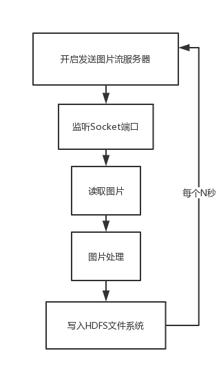
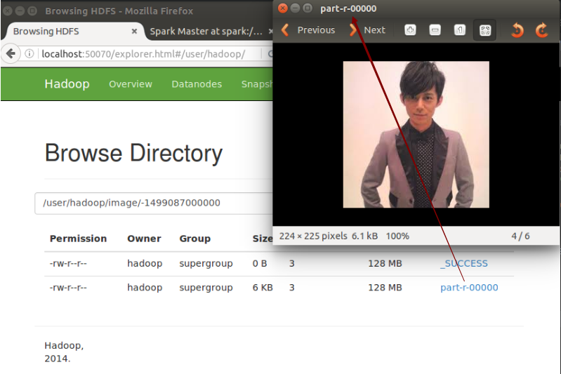

# image
利用Spark Streaming将图片以流的方式写入HDFS分布式文件系统上

# 说明
整个程序的流程图如下： 
 
如上图所示，第一步我们需要实现一个服务，该服务不停地向HDFS分布式文件系统里写入图片文件，这些图片文件后续会被用来当作数据源的原始数据并被进行各式各样的处理。具体代码见src/main/java/com/image/server/Server.java。代码运行参数配置见下图： 
 
接下来开启一个程序，实现开启Socket监听，从指定端口读取图片文件，这里使用的是Spark Streaming的socketStream方法获取数据流。程序代码是用Scala语言编写的，具体见src/main/scala/com/image/ImageStreaming.scala。这里需要注意的是如果您是在Intellij IDEA运行该文件，记得右键项目，选择Add Framework Support...，勾选Scala选项并保存。 
代码中设置了Spark上下文环境，设置了每隔多少时间（用户输入的第一个参数，单位：秒，具体参数设置见下图参数配置）读取一次数据源，然后开始调用重写的方法读入图片，我们需要对图片进行分析，分析过程不是本程序关注的重点，这里留了一个imageModel()方法，只是简单的获取字节长度，读者可以自己网上搜索图片分析的开源库，导入即可实现图片分析功能。 
 
当中自己定义了一个Scala类ImageInputDStream，用于加载Java的读入图片类。 
并且定义了写回图片文件时需要调用的ImageFileOutputFormat类，这个类继承了org.apache.hadoop.mapreduce.lib.output.FileOutputFormat类，通过缓冲区读取的方式加快数据读取。

# 结果

